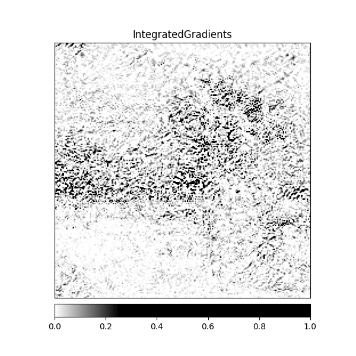
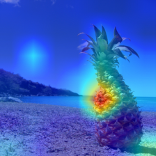

# Model Explainability - CV
| Predicted Class | Original Image| Integrated Gradients                 | Noise Tunnel | Saliency | Occlusion | SHAP | GradCAM | GradCAM++ | 
| -------- | -------- | --------                 | -------- | -------- | -------- | -------- | -------- | -------- | 
 | **parachute**                  | 
 
                 | 
 
                 | 
 
                 | 
 
                 | 
 
                 | 
 
                 | 
 
                 | 
 
 |  
 | **pot**                  | 
 
                 | 
 
                 | 
 
                 | 
 
                 | 
 
                 | 
 
                 | 
 
                 | 
 
 |  
 | **ski**                  | 
 
                 | 
 
                 | 
 
                 | 
 
                 | 
 
                 | 
 
                 | 
 
                 | 
 
 |  
 | **bridge**                  | 
 
                 | 
 
                 | 
 
                 | 
 
                 | 
 
                 | 
 
                 | 
 
                 | 
 
 |  
 | **stupa**                  | 
 
                 | 
 
                 | 
 
                 | 
 
                 | 
 
                 | 
 
                 | 
 
                 | 
 
 |  
 | **trombone**                  | 
 
                 | 
 
                 | 
 
                 | 
 
                 | 
 
                 | 
 
                 | 
 
                 | 
 
 |  
 | **umbrella**                  | 
 
                 | 
 
                 | 
 
                 | 
 
                 | 
 
                 | 
 
                 | 
 
                 | 
 
 |  
 | **wing**                  | 
 
                 | 
 
                 | 
 
                 | 
 
                 | 
 
                 | 
 
                 | 
 
                 | 
 
 |  
 | **yawl**                  | 
 
                 | 
 
                 | 
 
                 | 
 
                 | 
 
                 | 
 
                 | 
 
                 | 
 
 |  
 | **pineapple**                  | 
 
                 | 
 
                 | 
 
                 | 
 
                 | 
 
                 | 
 
                 | 
 
                 | 
 
 |  

 
 # Model Explainability - NLP

 
<strong>Bloomz 1.1B</strong>
 
             
 
 

 
<strong>Astrid 1B</strong>
 
             
 
 

 
<strong>GPT Bigcode Santacoder 1.12B 1.1B</strong>
 
             
 
 
